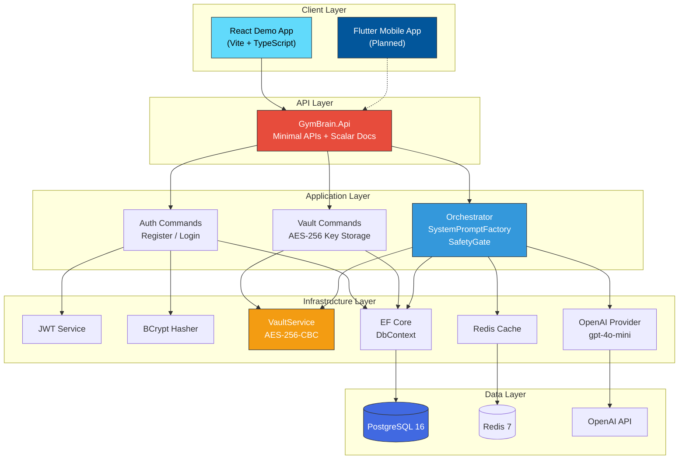
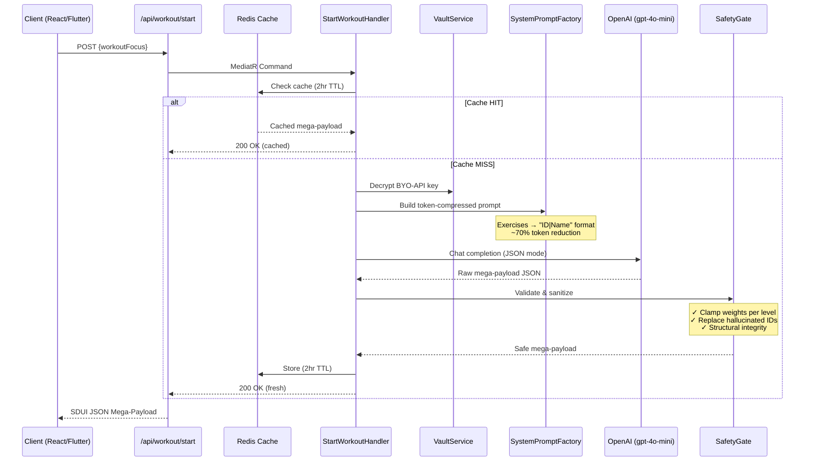

<div align="center">

# 🧠 GymBrain

**AI-Powered Fitness Coaching Platform**

*Personalized, real-time workout generation using LLM orchestration with Server-Driven UI*

[](https://dotnet.microsoft.com/)
[](https://react.dev/)
[](https://postgresql.org/)
[](https://redis.io/)
[](https://openai.com/)
[](LICENSE)
[](https://antigravity.google)
[](https://anthropic.com)

---

<p align="center">
  <strong>Generate intelligent, safety-gated workout plans in under 3 seconds</strong><br>
  <em>BYO-API Key model • $0.05/session cost ceiling • Egypt Law 151 compliant</em>
</p>

[Getting Started](#-getting-started) •
[Architecture](#-architecture) •
[API Reference](#-api-reference) •
[React Demo](#-react-demo-app) •
[Contributing](#-contributing)

</div>

---

## ✨ Features

| Feature | Description |
|---------|-------------|
| 🤖 **AI Workout Generation** | Leverages GPT-4o-mini to generate personalized workout plans in real-time |
| 🔐 **BYO-API Key Vault** | Users bring their own OpenAI/Anthropic keys, encrypted with AES-256-CBC |
| 🛡️ **Safety Gate Engine** | Deterministic C# rule engine sanitizes all LLM output — clamps weights, validates exercise IDs |
| ⚡ **Token-Compressed Prompts** | Exercises compressed to `ID\|Name` format, keeping costs under $0.05/session |
| 📱 **Server-Driven UI** | Backend generates JSON mega-payloads that drive the entire frontend UI |
| 💾 **Smart Caching** | Redis caches workout plans for 2 hours — zero LLM calls on app reload |
| 🏗️ **Clean Architecture** | Domain-driven design with strict dependency rules and CQRS via MediatR |
| 🔒 **Zero-Trust Security** | JWT auth, BCrypt hashing, AES-256 encryption, no secrets in source code |

---

## 🏗️ Architecture

### System Overview



### Clean Architecture Layers

```
┌─────────────────────────────────────────────────┐
│                  GymBrain.Api                    │  ← Entry point, endpoints, middleware
│              (Minimal APIs + Scalar)             │
├─────────────────────────────────────────────────┤
│              GymBrain.Infrastructure             │  ← EF Core, Redis, JWT, AES-256, OpenAI
│           (Implements Application interfaces)    │
├─────────────────────────────────────────────────┤
│              GymBrain.Application                │  ← Use cases, CQRS, orchestration logic
│         (MediatR + FluentValidation + SafetyGate)│
├─────────────────────────────────────────────────┤
│                GymBrain.Domain                   │  ← Entities, Value Objects, Interfaces
│           (Zero external dependencies)           │
└─────────────────────────────────────────────────┘

Dependency Rule: Outer layers depend on inner layers. Never the reverse.
```

### Orchestration Flow



---

## 🚀 Getting Started

### Prerequisites

| Tool | Version | Purpose |
|------|---------|---------|
| [.NET SDK](https://dotnet.microsoft.com/download) | 9.0+ | Backend API |
| [Node.js](https://nodejs.org/) | 20+ | React demo app |
| [Docker](https://docker.com/) | 20+ | PostgreSQL + Redis |
| [Git](https://git-scm.com/) | 2.x+ | Version control |

### 1. Clone & Setup

```bash
git clone https://github.com/YOUR_USERNAME/GymBrain.git
cd GymBrain
```

### 2. Start Infrastructure

```bash
docker compose up -d
```

This starts PostgreSQL 16 and Redis 7 with health checks.

### 3. Configure Secrets

> ⚠️ **Secrets are NEVER stored in `appsettings.json`**. Use .NET User Secrets for development.

```bash
# Initialize user secrets (already done if cloned)
dotnet user-secrets init --project src/GymBrain.Api

# Set JWT signing key (minimum 32 characters)
dotnet user-secrets set "Jwt:Secret" "YourSuperSecretKeyMinimum32Chars!" --project src/GymBrain.Api

# Generate and set AES-256 encryption key
# PowerShell:
$key = [Convert]::ToBase64String((1..32 | ForEach-Object { Get-Random -Max 256 }) -as [byte[]])
dotnet user-secrets set "Vault:EncryptionKey" $key --project src/GymBrain.Api

# Linux/Mac:
# openssl rand -base64 32 | xargs -I {} dotnet user-secrets set "Vault:EncryptionKey" "{}" --project src/GymBrain.Api
```

### 4. Create Database & Run API

```bash
# Create initial migration
dotnet ef migrations add InitialCreate \
  --project src/GymBrain.Infrastructure \
  --startup-project src/GymBrain.Api

# Run the API (auto-migrates on startup)
dotnet run --project src/GymBrain.Api
```

The API starts at `http://localhost:5000` with Scalar docs at `/scalar/v1`.

### 5. Run Tests

```bash
dotnet test GymBrain.sln
# Expected: 22/22 passed, 0 failed
```

### 6. Run React Demo

```bash
cd client
npm install
npm run dev
```

---

## 📡 API Reference

### Authentication

#### Register User
```http
POST /api/auth/register
Content-Type: application/json

{
  "email": "user@example.com",
  "password": "SecurePass123",
  "tonePersona": "Drill Sergeant"
}
```

**Response:**
```json
{
  "userId": "a1b2c3d4-...",
  "token": "eyJhbGciOiJIUzI1NiIs..."
}
```

#### Login
```http
POST /api/auth/login
Content-Type: application/json

{
  "email": "user@example.com",
  "password": "SecurePass123"
}
```

#### Vault BYO-API Key
```http
POST /api/auth/vault-key
Authorization: Bearer <jwt-token>
Content-Type: application/json

{
  "provider": "openai",
  "apiKey": "sk-proj-..."
}
```

### Workout Generation

#### Start Workout
```http
POST /api/workout/start
Authorization: Bearer <jwt-token>
Content-Type: application/json

{
  "workoutFocus": "upper body strength"
}
```

**Response:** SDUI Mega-Payload JSON (see [AI_CONTEXT.md](AI_CONTEXT.md) for schema)

### Health

| Endpoint | Response |
|----------|----------|
| `GET /` | `"GymBrain API is alive"` |
| `GET /health` | `{ "status": "healthy", "timestamp": "..." }` |
| `GET /scalar/v1` | Interactive API documentation |

---

## 🎨 React Demo App

The React demo app is a web-based client that demonstrates the full GymBrain workflow:

1. **Register/Login** — Create an account and authenticate
2. **Vault API Key** — Securely store your OpenAI API key (AES-256 encrypted)
3. **Generate Workout** — Get AI-powered workout plans rendered as SDUI components
4. **Interactive Tracking** — Track sets, reps, and rest timers

### Tech Stack

| Technology | Purpose |
|------------|---------|
| Vite | Build tool & dev server |
| React 19 | UI framework |
| TypeScript | Type safety |
| Vanilla CSS | Custom styling (dark OLED theme) |

> 📱 **Flutter mobile app** is planned for the next phase. The React demo validates the backend API contract first.

---

## 🔒 Security

| Layer | Implementation |
|-------|---------------|
| **Authentication** | JWT Bearer tokens (HMAC-SHA256, configurable expiry) |
| **Password Storage** | BCrypt with work factor 12 (never plaintext) |
| **API Key Storage** | AES-256-CBC encryption (unique IV per operation) |
| **Secrets Management** | .NET User Secrets (dev) / Environment Variables (prod) |
| **LLM Output Safety** | SafetyGate deterministic sanitizer (no re-prompting) |
| **Input Validation** | FluentValidation on all commands |
| **Token Security** | BYO-API keys decrypted in-memory only, never logged |

### Egypt Law 151 Compliance

- ✅ Encrypted data is not human-readable
- ✅ Unique IV per encryption operation
- ✅ PII never exposed in API responses
- ✅ API keys never appear in logs

---

## 💰 Cost Architecture

| Strategy | Impact |
|----------|--------|
| **gpt-4o-mini** | Cheapest capable model ($0.15/1M input, $0.60/1M output) |
| **Token compression** | `ID\|Name` format reduces prompt tokens ~70% |
| **2048 max_tokens** | Hard cap on response size |
| **Redis caching (2hr)** | Eliminates redundant LLM calls on reload |
| **SafetyGate** | No re-prompting — fixes output in C# |

**Target: ≤ $0.05 per session**

---

## 🧪 Testing

```bash
dotnet test GymBrain.sln --verbosity normal
```

| Suite | Tests | Coverage |
|-------|-------|----------|
| `GymBrain.Domain.Tests` | 5 | Result monad (success, failure, generics, implicit conversion) |
| `GymBrain.Application.Tests` | 8 | SafetyGate (weight clamping, ID validation), SystemPromptFactory (compression, persona) |
| `GymBrain.Infrastructure.Tests` | 5 | VaultService (round-trip, unique IV, tamper detection, Law 151) |
| `GymBrain.Api.Tests` | 4 | Scaffold tests |
| **Total** | **22** | **All passing ✅** |

---

## 📁 Project Structure

```
GymBrain/
├── 📄 .antigravityrules           # AI agent instructions & project rules
├── 📄 AI_CONTEXT.md               # LLM-friendly project state (updated per feature)
├── 📄 README.md                   # This file
├── 📄 GymBrain.sln                # .NET solution file
├── 📄 Directory.Build.props       # Shared build properties (net9.0, nullable, warnings)
├── 📄 docker-compose.yml          # PostgreSQL 16 + Redis 7
├── 📄 .env.example                # Environment variable template
├── 📄 .gitignore / .dockerignore
│
├── 📂 src/
│   ├── 📂 GymBrain.Domain/        # Pure domain layer (zero external deps)
│   │   ├── Common/                # BaseEntity, IDomainEvent, ValueObject, Result<T>
│   │   ├── Entities/              # User, Exercise
│   │   ├── Enums/                 # ExperienceLevel
│   │   └── Interfaces/            # IVaultService
│   │
│   ├── 📂 GymBrain.Application/   # Use cases & business logic
│   │   ├── Auth/Commands/         # Register, Login (MediatR + FluentValidation)
│   │   ├── Vault/Commands/        # VaultApiKey (AES-256 encrypt & store)
│   │   ├── Orchestration/         # SystemPromptFactory, SafetyGate
│   │   │   └── Commands/          # StartWorkout (full pipeline)
│   │   └── Common/Interfaces/     # IApplicationDbContext, ICacheService, ILlmProvider...
│   │
│   ├── 📂 GymBrain.Infrastructure/# Implementations
│   │   ├── Security/              # VaultService, JwtTokenService, BcryptPasswordHasher
│   │   ├── Persistence/           # DbContext, ExerciseSeeder, Configurations
│   │   ├── Providers/             # OpenAiProvider (gpt-4o-mini)
│   │   └── Services/              # RedisCacheService
│   │
│   └── 📂 GymBrain.Api/           # Entry point
│       ├── Endpoints/             # AuthEndpoints, WorkoutEndpoints
│       └── Program.cs             # DI, middleware, Scalar docs
│
├── 📂 tests/                      # 22 tests across 4 projects
│   ├── GymBrain.Domain.Tests/
│   ├── GymBrain.Application.Tests/
│   ├── GymBrain.Infrastructure.Tests/
│   └── GymBrain.Api.Tests/
│
└── 📂 client/                     # React demo app (Vite + TypeScript)
    ├── src/
    │   ├── components/
    │   ├── pages/
    │   ├── services/
    │   └── theme/
    └── package.json
```

---

## 🤖 AI Agent Instructions

This project was built with the assistance of **[Antigravity IDE](https://antigravity.google)** powered by **Claude Opus 4.6** (Anthropic). The repository includes two files designed for AI/LLM agents:

| File | Purpose |
|------|---------|
| [`.antigravityrules`](.antigravityrules) | Coding conventions, architecture rules, known pitfalls |
| [`AI_CONTEXT.md`](AI_CONTEXT.md) | Current project state, API contracts, continuation instructions |

**For AI agents resuming work:** Read both files before making any changes.

> ⚠️ **Push Rule:** All documentation (`README.md`, `AI_CONTEXT.md`) must be updated before pushing any feature to GitHub. No code-only pushes.

---

## 🗺️ Roadmap

- [x] **Phase 0:** Project scaffolding & Clean Architecture
- [x] **Epic 1:** Identity & Authentication (JWT + BCrypt)
- [x] **Epic 2:** API Vault (AES-256 encryption)
- [x] **Epic 3:** LLM Orchestrator (SystemPromptFactory + SafetyGate)
- [ ] **Epic 4:** React Demo App
- [ ] **Epic 5:** ExerciseDB API integration (RapidAPI + dual-layer caching)
- [ ] **Epic 6:** Flutter Mobile App (SDUI + Hive offline)
- [ ] **Epic 7:** Gamification (Shield/Sword/Scroll progression)

---

## 📜 License

This project is licensed under the MIT License — see the [LICENSE](LICENSE) file for details.

---

<div align="center">
  <strong>Built with 🧠 by the GymBrain Team</strong><br>
  <em>Powered by .NET 9 • React • OpenAI • PostgreSQL • Redis</em><br><br>
  <sub>Developed with <a href="https://antigravity.google">Antigravity IDE</a> + <a href="https://anthropic.com">Claude Opus 4.6</a></sub>
</div>
