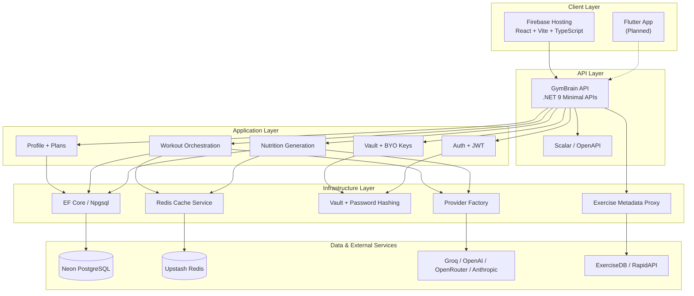
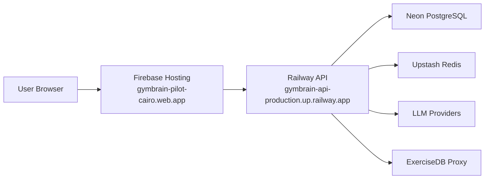
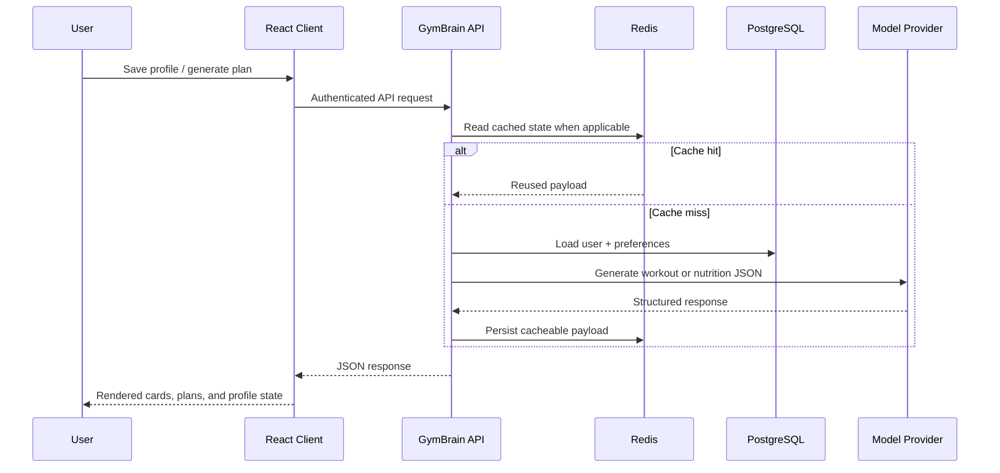

<div align="center">

# 🧠 GymBrain

**AI-Powered Fitness Coaching Platform**

*Personalized workout generation, nutrition planning, and progress tracking with a .NET 9 API and React client*

[](https://dotnet.microsoft.com/)
[](https://react.dev/)
[](https://www.typescriptlang.org/)
[](https://neon.tech/)
[](https://upstash.com/)
[](https://railway.app/)
[](https://firebase.google.com/)
[](LICENSE)

---

<p align="center">
  <strong>🚀 Live Frontend: <a href="https://gymbrain-pilot-cairo.web.app/">gymbrain-pilot-cairo.web.app</a></strong><br>
  <strong>⚙️ Live API: <a href="https://gymbrain-api-production.up.railway.app/health">gymbrain-api-production.up.railway.app</a></strong><br>
  <em>Firebase Hosting frontend • Railway backend • Neon PostgreSQL • Upstash Redis</em>
</p>

[Getting Started](#-getting-started) •
[Architecture](#-architecture) •
[API Reference](#-api-reference) •
[Deployment](#-deployment) •
[Contributing](#-contributing)

</div>

---

## ✨ Features

| Feature | Description |
|---------|-------------|
| 🤖 **AI Workout Generation** | Server-driven workout plans generated through GymBrain orchestration and safety gating |
| 🍽️ **AI Meal Plans** | Profile-aware nutrition generation with managed AI mode or BYO vaulted provider key |
| 🔐 **Vaulted API Keys** | User-supplied provider keys are encrypted before storage and only decrypted at execution time |
| 🛡️ **Safety & Limits** | Deterministic validation, per-user caps for managed AI, and auth-protected endpoints |
| 💾 **Redis Caching** | Cached workout and enrichment data backed by Redis for lower latency and lower provider cost |
| 🧍 **Profile Persistence** | Goal, equipment, injuries, diet, calories, and workout progress persist to PostgreSQL |
| 📋 **Plans & Progress** | Saved workouts, progression milestones, and profile-linked training state |
| 🎬 **Exercise Enrichment** | Optional ExerciseDB metadata and GIFs proxied through the backend with local caching |
| 📱 **Mobile-First React UI** | Vite + React + TypeScript client with tab navigation and profile-first flows |
| 🚀 **Production Hosting** | Firebase Hosting frontend with a persistent Railway API deployment |

---

## 🏗️ Architecture

### System Overview



### Production Deployment Topology



### Clean Architecture Layers

```text
┌─────────────────────────────────────────────────┐
│                  GymBrain.Api                    │  ← Endpoints, middleware, auth, CORS, docs
├─────────────────────────────────────────────────┤
│              GymBrain.Infrastructure             │  ← EF Core, Redis, JWT, vault, providers
├─────────────────────────────────────────────────┤
│              GymBrain.Application                │  ← Use cases, CQRS, orchestration, validation
├─────────────────────────────────────────────────┤
│                GymBrain.Domain                   │  ← Entities, enums, contracts, invariants
└─────────────────────────────────────────────────┘

Dependency Rule: Outer layers depend on inner layers. Never the reverse.
```

### Request Flow



---

## 🚀 Getting Started

### Prerequisites

| Tool | Version | Purpose |
|------|---------|---------|
| [.NET SDK](https://dotnet.microsoft.com/download) | 9.0+ | Backend API |
| [Node.js](https://nodejs.org/) | 20+ | React client |
| [Docker](https://docker.com/) | 20+ | Local PostgreSQL + Redis |
| [Git](https://git-scm.com/) | 2.x+ | Version control |

### 1. Clone & Setup

```bash
git clone https://github.com/csa7mdm/GymBrain.git
cd GymBrain
```

### 2. Start Local Infrastructure

```bash
docker compose up -d
```

### 3. Configure Development Secrets

> Secrets should not live in committed `appsettings*.json` files.

```bash
dotnet user-secrets init --project src/GymBrain.Api
dotnet user-secrets set "Jwt:Secret" "replace-with-a-real-secret-at-least-32-chars" --project src/GymBrain.Api
dotnet user-secrets set "Vault:EncryptionKey" "replace-with-base64-32-byte-key" --project src/GymBrain.Api
```

### 4. Run the Backend

```bash
dotnet run --project src/GymBrain.Api
```

Local endpoints:

- `http://localhost:5000/`
- `http://localhost:5000/health`
- `http://localhost:5000/scalar/v1`

### 5. Run the Frontend

```bash
cd client
npm install
npm run dev
```

The client uses `VITE_API_URL` to target the backend. Production builds read that value from [`client/.env.production`](client/.env.production).

---

## 📡 API Reference

### Authentication

| Endpoint | Purpose |
|----------|---------|
| `POST /api/auth/register` | Register a new user |
| `POST /api/auth/login` | Authenticate and receive JWT |
| `POST /api/auth/vault-key` | Store an encrypted provider key |
| `GET /api/auth/models` | Retrieve ranked model choices |

### Workouts

| Endpoint | Purpose |
|----------|---------|
| `POST /api/workout/start` | Generate a workout payload |
| `POST /api/workout/save` | Save a completed workout |
| `POST /api/workout/substitute` | Request substitutions |
| `GET /api/workout/exercise-metadata/{name}` | Optional exercise enrichment |

### Nutrition

| Endpoint | Purpose |
|----------|---------|
| `POST /api/nutrition/generate` | Generate a daily meal plan |

### Profile & Telemetry

| Endpoint | Purpose |
|----------|---------|
| `GET /api/profile` | Load saved profile state |
| `POST /api/profile/save` | Persist goals and preferences |
| `POST /api/profile/increment-workouts` | Update completed workout count |
| `POST /api/events` | Track product telemetry |

### Health

| Endpoint | Response |
|----------|----------|
| `GET /` | `"GymBrain API is alive"` |
| `GET /health` | JSON health payload |
| `GET /scalar/v1` | Interactive API documentation |

---

## 🎨 React Demo App

The React client is the current production surface and validates the backend contract end to end.

### Main Tabs

| Tab | Focus |
|-----|-------|
| **Home** | Dashboard and quick actions |
| **Train** | Workout generation, substitutions, tracking |
| **Plans** | Saved sessions and plan history |
| **Profile** | Body data, equipment, injuries, macros, vault |

### Client Notes

- The frontend is deployed to Firebase Hosting.
- Production API traffic goes to Railway through `VITE_API_URL`.
- Exercise metadata is optional enrichment; the client now treats missing metadata as a quiet no-content case.
- Sensitive request/response console logging has been removed from the production API client.

---

## 🚢 Deployment

### Production URLs

- Frontend: [https://gymbrain-pilot-cairo.web.app/](https://gymbrain-pilot-cairo.web.app/)
- Backend: [https://gymbrain-api-production.up.railway.app/](https://gymbrain-api-production.up.railway.app/)
- Health: [https://gymbrain-api-production.up.railway.app/health](https://gymbrain-api-production.up.railway.app/health)

### Backend Hosting

The backend deploys from the repository root using [`Dockerfile`](Dockerfile) on Railway.

Canonical production variables:

- `ConnectionStrings__DefaultConnection`
- `REDIS_CONNECTION`
- `VAULT_ENCRYPTION_KEY`
- `JWT__Secret`
- `JWT__Issuer=GymBrain`
- `JWT__Audience=GymBrain`
- `GYMBRAIN_MANAGED_LLM_KEY`
- `ASPNETCORE_ENVIRONMENT=Production`
- `PORT=8080`

### Frontend Hosting

The React client builds from [`client/`](client/) and deploys to Firebase Hosting.

```bash
cd client
npm run build
firebase deploy --only hosting --project gymbrain-pilot-cairo
```

### CORS Origins

Production origins are defined in [`src/GymBrain.Api/appsettings.Production.json`](src/GymBrain.Api/appsettings.Production.json):

- `https://gymbrain-pilot-cairo.web.app`
- `https://gymbrain-pilot-cairo.firebaseapp.com`
- `https://gymbrain-api-production.up.railway.app`

---

## 🔒 Security

| Layer | Implementation |
|-------|---------------|
| Authentication | JWT bearer tokens |
| Passwords | BCrypt hashing |
| Vaulted provider keys | Encryption before persistence |
| Secrets management | Environment variables / user secrets |
| Managed AI caps | Redis-backed per-user daily limits |
| CORS | Explicit production frontend origins |

### Security Notes

- Do not commit real secrets to source control.
- Rotate any secret ever exposed in logs, screenshots, or history.
- The API only seeds an admin user if `SeedAdmin:Email` and `SeedAdmin:Password` are explicitly configured.
- Keep `REDIS_CONNECTION` as the canonical Redis production variable.

---

## 💰 Cost Architecture

| Strategy | Impact |
|----------|--------|
| Redis caching | Reduces repeated provider calls |
| Managed AI cap | Controls free-tier backend cost |
| BYO provider key support | Shifts high-usage cost to user-owned credentials |
| Optional exercise enrichment | Avoids blocking workout UX when metadata is unavailable |

---

## 🧪 Testing

### Backend

```bash
dotnet test GymBrain.sln
```

Current backend test projects live under [`tests/`](tests/).

### Frontend

```bash
cd client
npm run build
```

### Browser Flows

```bash
cd client
npx playwright test
```

Playwright coverage lives under [`client/e2e/`](client/e2e/).

---

## 📁 Project Structure

```text
GymBrain/
├── README.md
├── AI_CONTEXT.md
├── .codexrules
├── .antigravityrules
├── GymBrain.sln
├── Dockerfile
├── client/
├── src/
└── tests/
```

---

## 🤖 AI / Agent Context

| File | Purpose |
|------|---------|
| [`.codexrules`](.codexrules) | Current repo-specific agent rules |
| [`.antigravityrules`](.antigravityrules) | Legacy agent guidance kept for continuity |
| [`AI_CONTEXT.md`](AI_CONTEXT.md) | Current architecture and delivery state |
| [`.gymbrain_knowledge.md`](.gymbrain_knowledge.md) | Append-only lessons learned log |

---

## 🗺️ Roadmap

- [x] Identity and authentication
- [x] Vaulted provider keys
- [x] Workout orchestration and safety gating
- [x] React production client
- [x] Multi-provider AI support
- [x] Profile persistence and plans
- [x] Nutrition generation
- [x] Railway + Firebase production deployment
- [ ] Flutter mobile app
- [ ] Gamification and deeper progression systems

---

## 🤝 Contributing

Contributions should keep the Clean Architecture boundaries intact, avoid committing secrets, and update the project docs when behavior or deployment changes.

---

## 📜 License

This project is licensed under the MIT License. See [LICENSE](LICENSE) for details.

---

<div align="center">
  <strong>Built for production with .NET 9, React 19, Railway, Firebase, PostgreSQL, and Redis.</strong>
</div>


