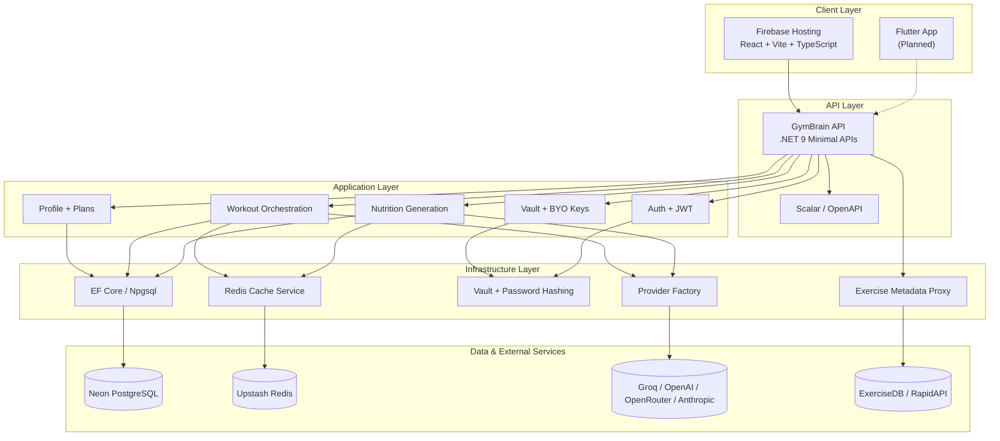
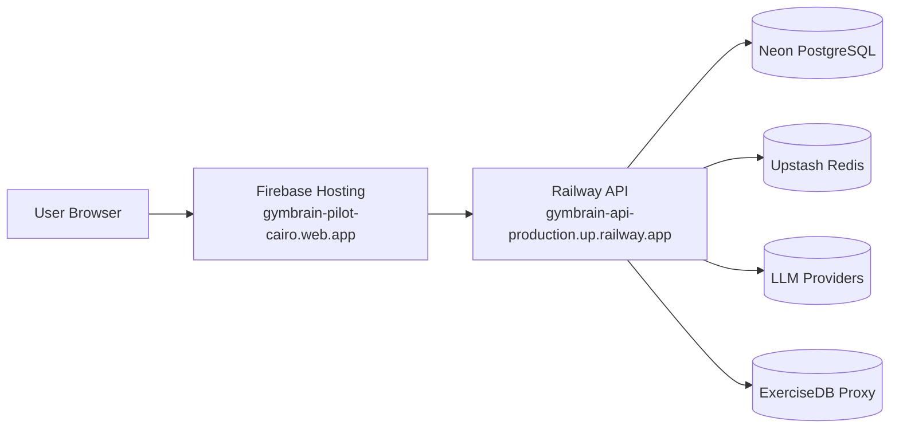
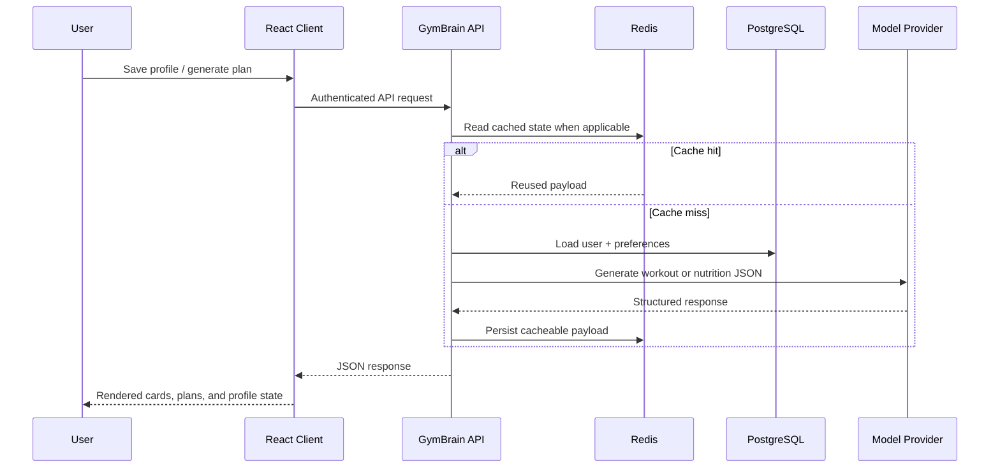

<div align="center">

# 🧠 GymBrain

**AI-Powered Fitness Coaching Platform**

*Personalized workout generation, nutrition planning, and progress tracking with a .NET 9 API and React client*

[](https://dotnet.microsoft.com/)
[](https://react.dev/)
[](https://www.typescriptlang.org/)
[](https://neon.tech/)
[](https://upstash.com/)
[](https://railway.app/)
[](https://firebase.google.com/)
[](LICENSE)

---

<p align="center">
  <strong>🚀 Live Frontend: <a href="https://gymbrain-pilot-cairo.web.app/">gymbrain-pilot-cairo.web.app</a></strong><br>
  <strong>⚙️ Live API: <a href="https://gymbrain-api-production.up.railway.app/health">gymbrain-api-production.up.railway.app</a></strong><br>
  <em>Firebase Hosting frontend • Railway backend • Neon PostgreSQL • Upstash Redis</em>
</p>

---

[Getting Started](#-getting-started) •
[Architecture](#-architecture) •
[API Reference](#-api-reference) •
[Deployment](#-deployment) •
[Contributing](#-contributing)

---

## ✨ Features

| Feature | Description |
|---------|-------------|
| 🤖 **AI Workout Generation** | Server-driven workout plans generated through GymBrain orchestration and safety gating |
| 🍽️ **AI Meal Plans** | Profile-aware nutrition generation with managed AI mode or BYO vaulted provider key |
| 🔐 **Vaulted API Keys** | User-supplied provider keys are encrypted before storage and only decrypted at execution time |
| 🛡️ **Safety & Limits** | Deterministic validation, per-user caps for managed AI, and auth-protected endpoints |
| 💾 **Redis Caching** | Cached workout and enrichment data backed by Redis for lower latency and lower provider cost |
| 🧍 **Profile Persistence** | Goal, equipment, injuries, diet, calories, and workout progress persist to PostgreSQL |
| 📋 **Plans & Progress** | Saved workouts, progression milestones, and profile-linked training state |
| 🎬 **Exercise Enrichment** | Optional ExerciseDB metadata and GIFs proxied through the backend with local caching |
| 📱 **Mobile-First React UI** | Vite + React + TypeScript client with tab navigation and profile-first flows |
| 🚀 **Production Hosting** | Firebase Hosting frontend with a persistent Railway API deployment |
| 🧩 **Result Pattern** | Typed success/failure handling for login and registration |
| 🏗️ **Vertical Slice Architecture** | Feature-based organization improving maintainability and team velocity |
| 🧪 **Backend Testing** | Unit tests for selected handlers and services, with build/test/image CI |
| 📚 **Architecture Docs** | C4 diagrams and ADRs documenting key decisions and system structure |
| ☁️ **Infrastructure as Code** | Draft Azure Terraform proposal; incomplete and not deployed |

---

## 🏗️ Architecture

### System Overview


```mermaid
graph TB
    subgraph "Client Layer"
        WEB["Firebase Hosting<br/>React + Vite + TypeScript"]
        MOBILE["Flutter App<br/>(Planned)"]
    end

    subgraph "API Layer"
        API["GymBrain API<br/>.NET 9 Minimal APIs"]
        DOCS["Scalar / OpenAPI"]
    end

    subgraph "Application Layer"
        AUTH["Auth + JWT"]
        PROFILE["Profile + Plans"]
        ORCH["Workout Orchestration"]
        NUTR["Nutrition Generation"]
        VAULT["Vault + BYO Keys"]
    end

    subgraph "Infrastructure Layer"
        EF["EF Core / Npgsql"]
        CACHE["Redis Cache Service"]
        CRYPTO["Vault + Password Hashing"]
        LLM["Provider Factory"]
        META["Exercise Metadata Proxy"]
    end

    subgraph "Data & External Services"
        PG[("Neon PostgreSQL")]
        REDIS[("Upstash Redis")]
        MODELS[("Groq / OpenAI / OpenRouter / Anthropic")]
        EXDB[("ExerciseDB / RapidAPI")]
    end

    WEB --> API
    MOBILE -.-> API
    API --> DOCS
    API --> AUTH
    API --> PROFILE
    API --> ORCH
    API --> NUTR
    API --> VAULT
    ORCH --> LLM
    NUTR --> LLM
    VAULT --> CRYPTO
    AUTH --> CRYPTO
    PROFILE --> EF
    ORCH --> CACHE
    ORCH --> EF
    NUTR --> CACHE
    NUTR --> EF
    META --> EXDB
    API --> META
    EF --> PG
    CACHE --> REDIS
    LLM --> MODELS
```

### Production Deployment Topology


```mermaid
graph LR
    USER["User Browser"] --> FIREBASE["Firebase Hosting<br/>gymbrain-pilot-cairo.web.app"]
    FIREBASE --> RAILWAY["Railway API<br/>gymbrain-api-production.up.railway.app"]
    RAILWAY --> NEON[("Neon PostgreSQL")]
    RAILWAY --> UPSTASH[("Upstash Redis")]
    RAILWAY --> PROVIDERS[("LLM Providers")]
    RAILWAY --> EXERCISEDB[("ExerciseDB Proxy")]
```

### Clean Architecture Layers

```text
┌─────────────────────────────────────────────────┐
│                  GymBrain.Api                    │  ← Endpoints, middleware, auth, CORS, docs
├─────────────────────────────────────────────────┤
│              GymBrain.Infrastructure             │  ← EF Core, Redis, JWT, vault, providers
├─────────────────────────────────────────────────┤
│              GymBrain.Application                │  ← Use cases, CQRS, orchestration, validation
├─────────────────────────────────────────────────┤
│                GymBrain.Domain                   │  ← Entities, enums, contracts, invariants
└─────────────────────────────────────────────────┘
```

Dependency Rule: Outer layers depend on inner layers. Never the reverse.

### Implementation Status

- Feature-oriented MediatR handlers and FluentValidation are implemented within the layered solution.
- [`Result` and `Result<T>`](src/GymBrain.Domain/Common/Result.cs) exist with typed errors and unit tests. Login and registration return typed Results with `Error` objects; other handlers still use DTOs and exceptions. Refresh tokens and a platform-wide Result migration remain planned.
- C4 documents and ADRs are linked below. The .NET 9 CI workflow builds/tests and builds the API image for pushes and pull requests to master/develop. Terraform is an incomplete Azure proposal, not the Railway deployment configuration.
- Nutrition generation uses Redis for usage counters, not meal-plan payload caching or persistence.

### Request Flow


```mermaid
sequenceDiagram
    participant U as User
    participant FE as React Client
    participant API as GymBrain API
    participant Cache as Redis
    participant DB as PostgreSQL
    participant LLM as Model Provider

    U->>FE: Save profile / generate plan
    FE->>API: Authenticated API request
    API->>Cache: Read cached state when applicable
    alt Cache hit
        Cache-->>API: Reused payload
    else Cache miss
        API->>DB: Load user + preferences
        API->>LLM: Generate workout or nutrition JSON
        LLM-->>API: Structured response
        API->>Cache: Persist cacheable payload
    end
    API-->>FE: JSON response
    FE-->>U: Rendered cards, plans, and profile state
```

### Architectural Documentation

The repository includes comprehensive architecture documentation:
- **C4 Model Diagrams**: System context, container, and component views in `/docs/architecture/`
- **Architecture Decision Records (ADRs)**: Key decisions documented in `/docs/adr/` including:
  - ADR 001: Result Pattern for Error Handling
  - ADR 002: FluentValidation with MediatR Pipeline Behaviors
- **Vertical Slice Architecture**: Feature-oriented handlers under Auth, Orchestration, Profile, Vault, and Workout within the layered solution

---

## 🚀 Getting Started

### Prerequisites

| Tool | Version | Purpose |
|------|---------|---------|
| [.NET SDK](https://dotnet.microsoft.com/download) | 9.0+ | Backend API |
| [Node.js](https://nodejs.org/) | 20+ | React client |
| [Docker](https://docker.com/) | 20+ | Local PostgreSQL + Redis |
| [Git](https://git-scm.com/) | 2.x+ | Version control |

### 1. Clone & Setup

```bash
git clone https://github.com/csa7mdm/GymBrain.git
cd GymBrain
```

### 2. Start Local Infrastructure

```bash
docker compose up -d
```

### 3. Configure Development Secrets

> Secrets should not live in committed `appsettings*.json` files.

```bash
dotnet user-secrets init --project src/GymBrain.Api
dotnet user-secrets set "Jwt:Secret" "replace-with-a-real-secret-at-least-32-chars" --project src/GymBrain.Api
dotnet user-secrets set "Vault:EncryptionKey" "replace-with-base64-32-byte-key" --project src/GymBrain.Api
```

### 4. Run the Backend

```bash
dotnet run --project src/GymBrain.Api
```

Local endpoints:

- `http://localhost:5000/`
- `http://localhost:5000/health`
- `http://localhost:5000/scalar/v1`

### 5. Run the Frontend

```bash
cd client
npm install
npm run dev
```

The client uses `VITE_API_URL` to target the backend. Production builds read that value from [`client/.env.production`](client/.env.production).

---

## 📡 API Reference

### Authentication

| Endpoint | Purpose |
|----------|---------|
| `POST /api/auth/register` | Register a new user |
| `POST /api/auth/login` | Authenticate and receive JWT |
| `POST /api/auth/vault-key` | Store an encrypted provider key |
| `GET /api/auth/models` | Retrieve ranked model choices |

### Workouts

| Endpoint | Purpose |
|----------|---------|
| `POST /api/workout/start` | Generate a workout payload |
| `POST /api/workout/save` | Save a completed workout |
| `POST /api/workout/substitute` | Request substitutions |
| `GET /api/workout/exercise-metadata/{name}` | Optional exercise enrichment |

### Nutrition

| Endpoint | Purpose |
|----------|---------|
| `POST /api/nutrition/generate` | Generate a daily meal plan |

### Profile & Telemetry

| Endpoint | Purpose |
|----------|---------|
| `GET /api/profile` | Load saved profile state |
| `POST /api/profile/save` | Persist goals and preferences |
| `POST /api/profile/increment-workouts` | Update completed workout count |
| `POST /api/events` | Track product telemetry |

### Health

| Endpoint | Response |
|----------|----------|
| `GET /` | `"GymBrain API is alive"` |
| `GET /health` | JSON health payload |
| `GET /scalar/v1` | Interactive API documentation |

---

## 🎨 React Demo App

The React client is the current production surface and validates the backend contract end to end.

### Main Tabs

| Tab | Focus |
|-----|-------|
| **Home** | Dashboard and quick actions |
| **Train** | Workout generation, substitutions, tracking |
| **Plans** | Saved sessions and plan history |
| **Profile** | Body data, equipment, injuries, macros, vault |

### Client Notes

- The frontend is deployed to Firebase Hosting.
- Production API traffic goes to Railway through `VITE_API_URL`.
- Exercise metadata is optional enrichment; the client now treats missing metadata as a quiet no-content case.
- Sensitive request/response console logging has been removed from the production API client.

---

## 🚢 Deployment

### Production URLs

- Frontend: [https://gymbrain-pilot-cairo.web.app/](https://gymbrain-pilot-cairo.web.app/)
- Backend: [https://gymbrain-api-production.up.railway.app/](https://gymbrain-api-production.up.railway.app/)
- Health: [https://gymbrain-api-production.up.railway.app/health](https://gymbrain-api-production.up.railway.app/health)

### Backend Hosting

The backend deploys from the repository root using [`Dockerfile`](Dockerfile) on Railway.

Production configuration (set secret values in Railway):

- `ConnectionStrings__DefaultConnection`
- `REDIS_CONNECTION` (required for workout rate limits and managed AI usage counters; blank disables Redis)
- `VAULT_ENCRYPTION_KEY`
- `JWT__Secret`
- `JWT__Issuer=GymBrain`
- `JWT__Audience=GymBrain`
- `GYMBRAIN_MANAGED_LLM_KEY` (required for managed AI; BYO credentials are stored through the vault)
- `ASPNETCORE_ENVIRONMENT=Production`
- `PORT=8080`

Redis connections are created on demand. Unavailable payload caching degrades to cache misses/skipped writes; operations requiring usage counters return HTTP 503 rather than bypassing limits. All workout starts require Redis because they have an hourly limit. The local default is `ConnectionStrings:Redis=localhost:6379`.

The container listens on port 8080; configure the Railway service target port accordingly. `PORT` alone does not change the listener. PostgreSQL must be reachable at startup because the API applies migrations before serving requests. `/health` is a liveness response, not a Redis dependency check.

For a service connected to `master` with automatic deployments enabled, a pushed commit should trigger a deployment. Otherwise deploy the desired commit manually in Railway. Check the build logs and `/health` after deployment; repository validation alone does not establish production health.

### Frontend Hosting

The React client builds from [`client/`](client/) and deploys to Firebase Hosting.

```bash
cd client
npm run build
firebase deploy --only hosting --project gymbrain-pilot-cairo
```

### Infrastructure as Code

The repository includes Draft Azure Terraform proposal; incomplete and not deployed in `/infra/`:
- Azure PostgreSQL Flexible Server (Neon equivalent)
- Azure Redis Cache (Upstash equivalent)
- App Service Plan and Web App for the API
- Virtual network with service delegation subnets

### CORS Origins

Production origins are defined in [`src/GymBrain.Api/appsettings.Production.json`](src/GymBrain.Api/appsettings.Production.json):

- `https://gymbrain-pilot-cairo.web.app`
- `https://gymbrain-pilot-cairo.firebaseapp.com`
- `https://gymbrain-api-production.up.railway.app`

---

## 🔒 Security

| Layer | Implementation |
|-------|----------------|
| Authentication | JWT bearer tokens |
| Passwords | BCrypt hashing |
| Vaulted provider keys | Encryption before persistence |
| Secrets management | Environment variables / user secrets |
| Managed AI caps | Redis-backed per-user daily limits |
| CORS | Explicit production frontend origins |
| Error Handling | Typed Results for login/registration; other errors use middleware |

### Security Notes

- Do not commit real secrets to source control.
- Rotate any secret ever exposed in logs, screenshots, or history.
- The API only seeds an admin user if `SeedAdmin:Email` and `SeedAdmin:Password` are explicitly configured.
- Keep `REDIS_CONNECTION` as the canonical Redis production variable.
- Login failures return HTTP 401 and duplicate registration returns HTTP 400 with a detail field. FluentValidation still throws ValidationException; middleware maps it to HTTP 400. Other handlers have not migrated to Result.

---

## 💰 Cost Architecture

| Strategy | Impact |
|----------|--------|
| Redis caching | Reduces repeated provider calls |
| Managed AI cap | Controls free-tier backend cost |
| BYO provider key support | Shifts high-usage cost to user-owned credentials |
| Optional exercise enrichment | Avoids blocking workout UX when metadata is unavailable |
| Result pattern | Eliminates exception overhead for expected business flows |

---

## 🧪 Testing

### Backend

```bash
dotnet test GymBrain.sln
```

Backend tests under [`tests/`](tests/) cover login/registration with EF Core InMemory and test doubles, Result invariants, workout prompts, safety rules, injury filtering, vault encryption, and Redis fallback behavior. The API test project is currently an empty scaffold; HTTP integration coverage is planned. Empty placeholder tests have been removed.

### Frontend

```bash
cd client
npm run build
```

### Browser Flows

```bash
cd client
npx playwright test
```

Playwright coverage lives under [`client/e2e/`](client/e2e/).

---

## 📁 Project Structure

```text
GymBrain/
├── README.md
├── AI_CONTEXT.md
├── .antigravityrules
├── GymBrain.sln
├── Dockerfile
├── infra/
│   └── main.tf              # Terraform infrastructure definitions
├── client/
├── src/
│   ├── GymBrain.Api/
│   │   ├── Endpoints/       # API endpoints with Result pattern handling
│   │   └── Program.cs
│   ├── GymBrain.Application/
│   │   ├── Workout/         # Exercise metadata query
│   │   ├── Common/          # Shared interfaces, behaviors, validation
│   │   └── Auth/            # Authentication commands/queries/handlers
│   ├── GymBrain.Domain/
│   │   ├── Common/          # Result pattern, Error classes
│   │   ├── Entities/        # Domain models
│   │   └── Enums/
│   ├── GymBrain.Infrastructure/
│   │   ├── Persistence/     # EF Core configuration
│   │   ├── Services/        # Redis cache, JWT token service, etc.
│   │   └── Security/        # Password hashing, rate limiting
├── tests/
│   └── GymBrain.Application.Tests/  # Unit tests for application layer
├── docs/
│   ├── architecture/        # C4 model diagrams
│   │   ├── 01-SystemContext.md
│   │   ├── 02-Container.md
│   │   └── 03-Component.md
│   └── adr/                 # Architecture Decision Records
│       ├── 001-result-pattern.md
│       └── 002-fluentvalidation-mediatr.md
└── content/
    ├── linkedin-post-architecture-refactor.md
    ├── linkedin-post-arabic.md
    └── presentation/
        └── gymbrain-architecture-refactor.md
```

---

## 🤖 AI / Agent Context

| File | Purpose |
|------|---------|
| [`.antigravityrules`](.antigravityrules) | Legacy agent guidance kept for continuity |
| [`AI_CONTEXT.md`](AI_CONTEXT.md) | Current architecture and delivery state |
| [`$.gymbrain_knowledge.md`](.gymbrain_knowledge.md) | Append-only lessons learned log |

---

## 🗺️ Roadmap

- [x] Identity and authentication
- [x] Vaulted provider keys
- [x] Workout orchestration and safety gating
- [x] React production client
- [x] Multi-provider AI support
- [x] Profile persistence and plans
- [x] Nutrition generation
- [x] Railway + Firebase production deployment
- [x] Result pattern for error handling
- [x] Redis caching implementation
- [x] Vertical slice architecture
- [x] Unit tests for selected handlers and services
- [x] GitHub Actions build/test/image CI
- [ ] Deployable infrastructure as code (Azure Terraform draft only)
- [x] Architecture documentation (C4 diagrams, ADRs)
- [ ] Flutter mobile app
- [ ] Gamification and deeper progression systems
- [ ] Refresh token rotation for enhanced security
- [ ] Distributed tracing with OpenTelemetry

---

## 🤝 Contributing

Contributions should keep the Clean Architecture boundaries intact, avoid committing secrets, and update the project docs when behavior or deployment changes.

When contributing:
1. Follow the existing architectural patterns (Result pattern, vertical slices)
2. Write unit tests for new functionality
3. Update architecture documentation if significant changes are made
4. Ensure all secrets are managed through environment variables or user secrets
5. Keep CORS origins updated for new frontend deployments

---

## 📜 License

This project is licensed under the MIT License. See [LICENSE](LICENSE) for details.

---

<div align="center">
  <strong>Built for production with .NET 9, React 19, Railway, Firebase, PostgreSQL, and Redis.</strong><br>
  <strong>Enhanced with Result pattern, vertical slice architecture, caching, testing, and DevOps automation.</strong>
</div>